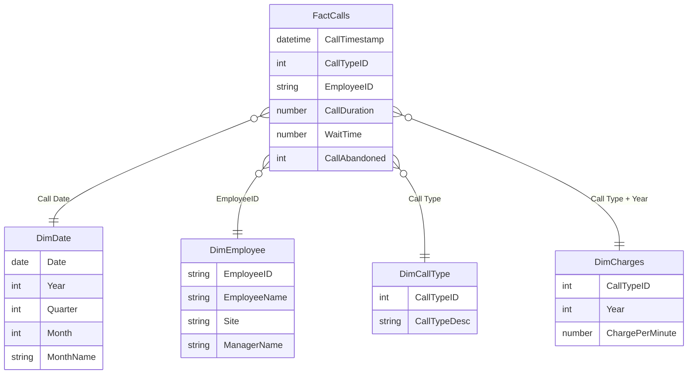
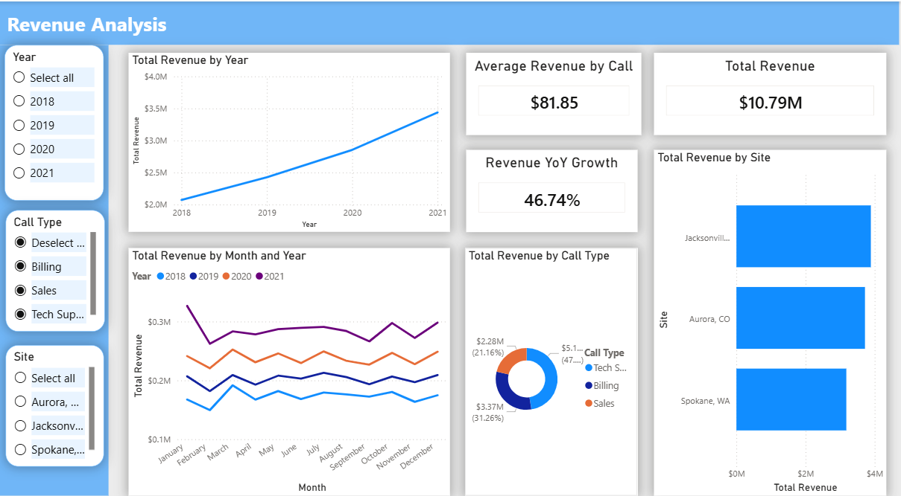

# Call Center Analytics Power BI Project

This project is a Power BI end-to-end analytics solution built from messy, multi-source call center data.
The main focus of this project is not only dashboard design, but also the full data modeling process: cleaning raw files, combining multiple years of data, building a clean star schema, creating a date table, and writing reusable DAX measures for business analysis.

## Project Objective

The goal of this project is to transform raw call center operational data into a clean analytical model that supports performance monitoring, revenue analysis, SLA tracking, and employee/manager performance evaluation.

The final Power BI dashboard allows users to answer questions such as:

- How many calls were handled?
- What is the average call duration and wait time?
- What is the SLA performance?
- How much revenue was generated?
- How does revenue change year over year?
- Which employees and managers perform best?
- Which call types drive the most activity and revenue?

## Raw Data Sources

The project starts with multiple raw source files in different formats:

```text
Call+Center+Data+2018.csv
Call+Center+Data+2019.csv
Call+Center+Data+2020.csv
Call+Center+Data+2021.xlsx
Call Charges.xlsx
Lookup+Tables.xlsx
```

The raw data includes:

- Multi-year call transaction data
- Call timestamps
- Call type IDs
- Employee IDs
- Call duration
- Wait time
- Abandoned call indicator
- Call charge rates by year
- Employee lookup table
- Call type lookup table

## Data Preparation and Cleaning

A major part of this project was preparing the raw data for analysis.

Key data cleaning steps included:

- Imported data from both CSV and Excel files
- Standardized column names across multiple yearly files
- Combined 2018, 2019, 2020, and 2021 call records into one fact table
- Converted timestamp fields into proper date/time formats
- Extracted date-related fields for time intelligence
- Cleaned and validated employee and call type lookup tables
- Joined charge rate information to support revenue calculation
- Removed unnecessary raw columns from the final analytical model
- Ensured correct data types for IDs, dates, durations, wait times, and numeric measures

## Data Modeling

The core of this project is the Power BI data model.

Instead of building visuals directly from raw flat files, I transformed the data into a clean star schema to improve performance, readability, and analytical flexibility.

### Star Schema Design


## Model Tables

### Fact Table

**FactCalls**

The main transaction table containing call-level records from 2018 to 2021.

Example fields:

- CallTimestamp
- Call Type
- EmployeeID
- CallDuration
- WaitTime
- CallAbandoned

### Dimension Tables

**DimDate**

A dedicated date table created to support time intelligence calculations such as year-over-year growth.

**DimEmployee**

Employee lookup table containing employee name, site, and manager information.

**DimCallType**

Call type lookup table used to translate call type IDs into readable business categories such as Sales, Billing, and Tech Support.

**DimCharges**

Charge rate table used to calculate revenue based on call type and year.

## DAX Measures

Reusable DAX measures were created instead of relying on implicit aggregations.
This makes the model easier to maintain and ensures consistent KPI definitions across report pages.

Key measures include:

- Total Calls Handled
- Average Call Duration
- Average Wait Time
- SLA Rate
- Total Revenue
- Revenue YoY Growth
- Average Revenue per Call
- Total Employee Number
- Total Team Number
- Average Calls Handled by Employee
- Average Revenue by Employee
- Top Employees by Revenue
- Top Employees by SLA Rate
- Top Employees by Calls Handled

## Dashboard Pages

The final report includes several dashboard pages built on top of the cleaned semantic model.

### 1. Call Center Overview

Provides a high-level operational summary, including:

- Total calls handled
- Average call duration
- Average wait time
- SLA rate
- Call type filtering
- Site and employee-level exploration

### 2. Revenue Analysis

Focuses on revenue performance, including:

- Total revenue
- Revenue year-over-year growth
- Average revenue per call
- Revenue trend analysis
- Revenue comparison by call type and business segment

### 3. Employee Performance

Analyzes employee-level performance, including:

- Average calls handled by employee
- Average revenue by employee
- Top 3 employees by average revenue per call
- Top 3 employees by SLA rate
- Top 3 employees by calls handled

### 4. Manager Performance

Summarizes team and manager-level performance to support operational decision-making.

## Skills Demonstrated

This project demonstrates the following Power BI and data analytics skills:

- Power Query data transformation
- Multi-source data import
- Data cleaning and standardization
- Appending multiple yearly datasets
- Building a star schema
- Creating dimension and fact tables
- Creating a dedicated date table
- Managing table relationships
- Writing reusable DAX measures
- Time intelligence analysis
- Revenue calculation logic
- KPI dashboard design
- Business performance analysis

## Tools Used

- Power BI Desktop
- Power Query
- DAX
- Data modeling
- Data visualization

## Repository Structure

```text
.
├── call_center.pbix
├── README.md
├── data/
│   ├── Call+Center+Data+2018.csv
│   ├── Call+Center+Data+2019.csv
│   ├── Call+Center+Data+2020.csv
│   ├── Call+Center+Data+2021.xlsx
│   ├── Call Charges.xlsx
│   └── Lookup+Tables.xlsx
└── screenshots/
    ├── call-center-overview.png
    ├── revenue-analysis.png
    ├── employee-performance.png
    └── manager-performance.png
```

## Screenshots

### Call Center Overview


### Revenue Analysis



### Employee Performance


### Manager Performance

.png)

## Key Takeaway

This project shows the full workflow of a Power BI analytics project: starting from messy raw files, transforming them into a clean and scalable data model, creating business-focused DAX measures, and finally designing dashboards that communicate insights clearly.


