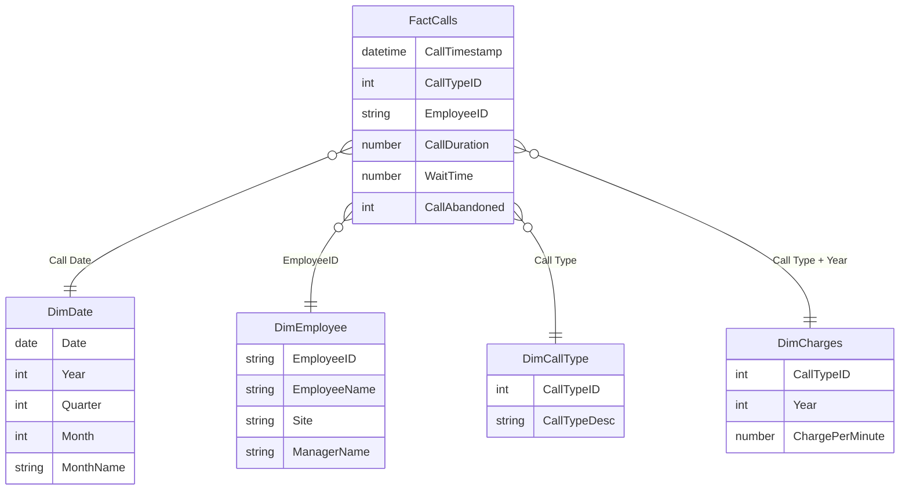

# Call Center Analytics Power BI Project

This project is a Power BI end-to-end analytics solution built from messy, multi-source call center data.
The main focus of this project is not only dashboard design, but also the full data modeling process: cleaning raw files, combining multiple years of data, building a clean star schema, creating a date table, and writing reusable DAX measures for business analysis.

## Project Objective

The goal of this project is to transform raw call center operational data into a clean analytical model that supports performance monitoring, revenue analysis, SLA tracking, and employee/manager performance evaluation.

The final Power BI dashboard allows users to answer questions such as:

- How many calls were handled?
- What is the average call duration and wait time?
- What is the SLA performance?
- How much revenue was generated?
- How does revenue change year over year?
- Which employees and managers perform best?
- Which call types drive the most activity and revenue?

## Raw Data Sources

The project starts with multiple raw source files in different formats:

```text
Call+Center+Data+2018.csv
Call+Center+Data+2019.csv
Call+Center+Data+2020.csv
Call+Center+Data+2021.xlsx
Call Charges.xlsx
Lookup+Tables.xlsx
```

The raw data includes:

- Multi-year call transaction data
- Call timestamps
- Call type IDs
- Employee IDs
- Call duration
- Wait time
- Abandoned call indicator
- Call charge rates by year
- Employee lookup table
- Call type lookup table

## Data Preparation and Cleaning

A major part of this project was preparing the raw data for analysis.

Key data cleaning steps included:

- Imported data from both CSV and Excel files
- Standardized column names across multiple yearly files
- Combined 2018, 2019, 2020, and 2021 call records into one fact table
- Converted timestamp fields into proper date/time formats
- Extracted date-related fields for time intelligence
- Cleaned and validated employee and call type lookup tables
- Joined charge rate information to support revenue calculation
- Removed unnecessary raw columns from the final analytical model
- Ensured correct data types for IDs, dates, durations, wait times, and numeric measures

## Data Modeling

The core of this project is the Power BI data model.

Instead of building visuals directly from raw flat files, I transformed the data into a clean star schema to improve performance, readability, and analytical flexibility.

### Star Schema Design



